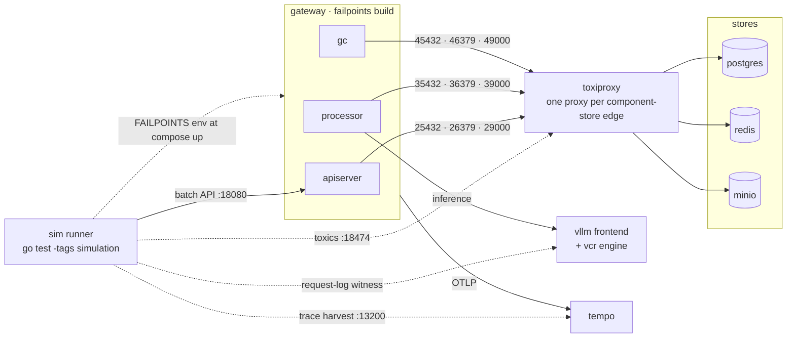

# Consistency Simulation Harness

Executable reproductions of the cross-store consistency bugs cataloged in
[docs/design/consistency-harness.md](../../docs/design/consistency-harness.md).
Real Postgres, Redis, and MinIO; real gateway binaries built with the
`failpoints` tag; inference served by
[vllm-vcr](https://github.com/neuralmagic/vllm-vcr) (real vLLM Rust frontend,
simulated engine-core, no GPU).

## Topology



Solid edges are the data path; dashed edges are how the runner injects faults
and collects evidence. Each component reaches every store through its own
toxiproxy listeners (ports above), which is what lets a scenario cut exactly
one edge, e.g. blackhole apiserver↔redis responses while the processor's
redis connection stays healthy. In host-vcr fallback mode the `vcr` box is
two host processes instead of a container; everything else is identical.

## Prerequisites

- Docker (or a `docker`-compatible CLI) with compose v2
- The vllm-vcr image. Build it from the vllm-vcr repo:
  `podman build -t ghcr.io/neuralmagic/vllm-vcr:dev .` or set `VCR_IMAGE`.
  First startup downloads the model tokenizer from Hugging Face into the
  `hf-cache` volume.

Scenarios skip (not fail) when docker or the vcr image is unavailable.

Without the container image the harness falls back to host mode: it launches
`vllm-rs` (`VLLM_RS_BIN`, default `~/git/vllm-main/rust/target/debug/vllm-rs`)
and `vllm-vcr play` (`VLLM_VCR_BIN`, default
`~/git/vllm-vcr/target/debug/vllm-vcr`) on the host and forwards the compose
`vcr` service to them. The two binaries must target the same vLLM engine-core
wire version; a mismatch shows up as messagepack decode errors and every
inference request failing with 500s, which silently turns "completed" batches
into batches full of error bodies.

## Backends

The harness runs against one of two stacks, selected with `SIM_BACKEND`:

- **compose** (default): docker compose topology with vllm-vcr inference.
  Fast, fully self-contained, fresh volumes per scenario.
- **kind**: a dev-deploy'd Kind cluster. Real pod replacement semantics,
  Jaeger traces, optional EPP on the inference path, and multi-replica
  processors for async scenarios. Deploy once with
  `make sim-kind-deploy` (add `ENABLE_GIE=true` for the EPP; add
  `IMAGE_BUILD_EXTRA_ARGS=--load` when docker uses a buildx container
  driver, or the built images never reach the local store), then run with
  `SIM_BACKEND=kind`. Scenarios reset Redis/Postgres/bucket state between
  runs but reuse the cluster. The reconciler runs at 30s there (vs 5s in
  compose); scenarios scale their timing from `params()`.

## Run

```bash
make test-simulation                    # compose backend
SIM_BACKEND=kind make test-simulation   # against the Kind cluster
```

Or one scenario:

```bash
go test -v -tags=simulation -count=1 -timeout=30m ./test/simulation/ -run TestF1a
```

Each scenario brings the topology up with fresh store volumes, arms
failpoints via the `FAILPOINTS` env var (see `internal/util/failpoint`),
drives the API, lets recovery mechanisms run at compressed intervals
(reconciler 5s, poll 1s), and judges the outcome against `ratchet.yaml`.

## Network faults (compose only)

Every gateway-component store connection is routed through
[toxiproxy](https://github.com/Shopify/toxiproxy) on a per-component-per-store
proxy (`config/toxiproxy.json`), so a scenario can partition exactly one edge:
cut apiserver↔redis while the processor's redis connection stays healthy.
Scenarios apply and remove toxics through the control API on host port 18474
(`toxics.go`); harness cleanup heals all proxies so a failed scenario cannot
poison the next. The false-failure scenarios (F1b, F1c) and any scenario
needing the vcr request-log witness skip on the kind backend.

The witness: the vcr engine logs every request it serves (`--log-requests`),
so duplicate or phantom execution is counted at the one place it cannot be
hidden. `F4b` asserts requests served ≤ batch line count; `F1b` asserts a
5xx'd create serves zero.

## The ratchet

`ratchet.yaml` records the expected outcome per scenario:

- `broken` means the bug exists. The scenario must reproduce its invariant
  violation; if it cannot, the reproduction has rotted or the bug is fixed,
  and the test tells you to promote the entry.
- `fixed` means the bug is fixed. Any violation is a regression and fails.

Promote entries as rearchitecture phases land. Demoting `fixed` back to
`broken` is a reviewable change.

## Layout

| Path | Purpose |
|---|---|
| `compose.yaml` | topology: stores, toxiproxy, gateway binaries, vcr model server |
| `config/` | compressed-interval configs; `processor-stale-heartbeat.yaml` simulates heartbeat loss; `toxiproxy.json` the proxy mesh |
| `secrets/<component>/` | per-component connection URLs mounted at `/etc/.secrets`; generated per run with random credentials, gitignored |
| `harness.go` | compose control, readiness, log capture |
| `client.go` | minimal OpenAI-compatible API client |
| `timeline.go` | status observer + transition-graph invariants |
| `toxics.go` | toxiproxy control + the vcr request-log witness |
| `ratchet.go`, `ratchet.yaml` | expected-outcome manifest and judge |
| `scenarios_test.go`, `scenarios_network_test.go` | one test per finding |
